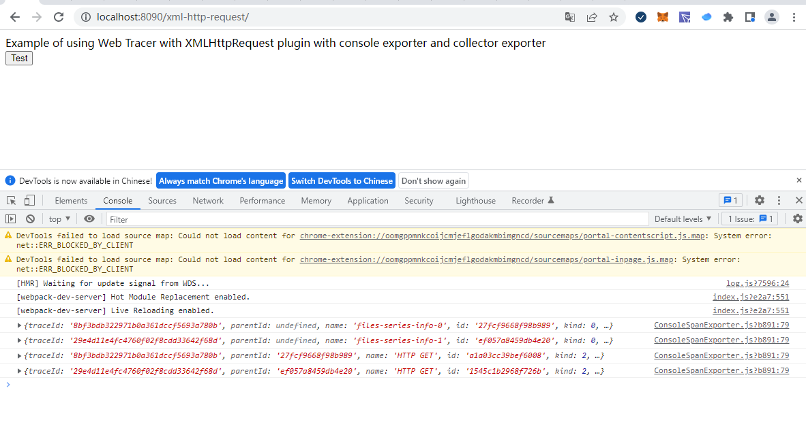
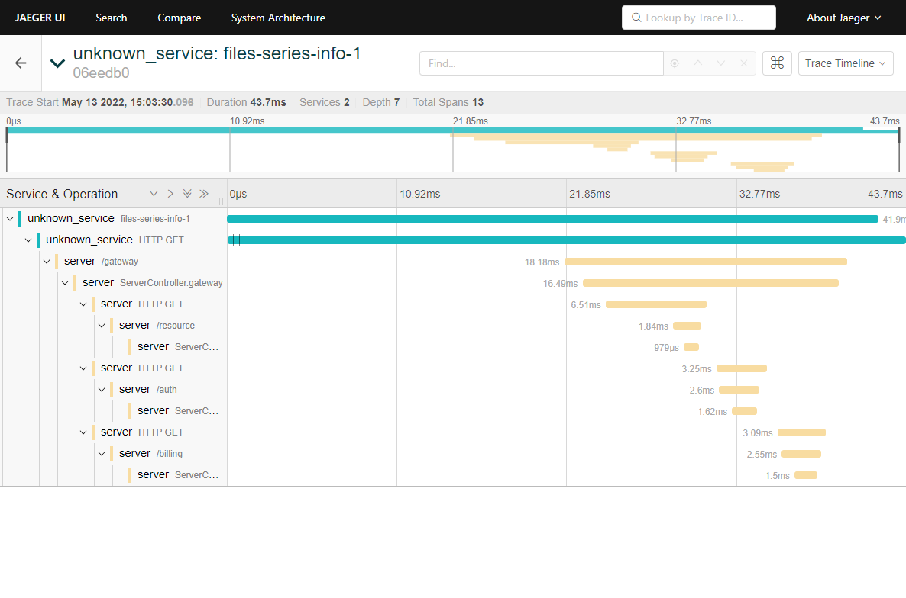

# 概述

这个例子展示了如何使用[@opentelemetry/sdk trace web](https://github.com/open-telemetry/opentelemetry-js/tree/main/packages/opentelemetry-sdk-trace-web)使用不同的插件和设置来检测浏览器中运行的JavaScript代码。同时也展示了如何与后端APM结合实现trace联动效果。

## 安装

```sh
# from this directory
npm install
```

## 启动

```sh
# from this directory
npm start
```

默认端口 `8090`.

运行应用程序的其他选项，这与使用不同源文件处理的示例相同，因此您可以查看对通过浏览器加载的结果包大小的不同影响。

| 命令                    | 描述         |
| --------------------- | ---------- |
| `npm start` (Default) | 通过GZip压缩数据 |
| `npm run start-nc`    | 数据不压缩      |

开发模式包括通过webpack devtool“eval source map”模式生成的源地图，这大大增加了捆绑包的大小。

## 例子

### XMLHttpRequest

这个例子展示了如何将XMLHttpRequest工具与OTLP跟踪导出器和B3传播器一起使用。

包含组件

- XMLHttpRequestInstrumentation
- ZoneContextManager
- OTLPTraceExporter
- ZipkinExporter
- WebTracerProvider
- B3Propagator

浏览器访问 <http://localhost:8090/xml-http-request/> . 应用采用`ConsoleSpanExporter` 可以在浏览器console查看trace信息。
像这样：



### ZipkinExporter

#### 安装 zipkin
https://github.com/lrwh/observable-demo/tree/main/apm/zipkin


#### 将数据推送到 zipkin

```js
const zipkinOptions = {
  url: 'http://192.168.91.11:9411/api/v2/spans', // optional
}

const zipkinExporter = new ZipkinExporter(zipkinOptions);

providerWithZone.addSpanProcessor(new SimpleSpanProcessor(zipkinExporter));
```


### OTLPTraceExporter

#### 将数据推送到 otlp

```js
const otelExporter = new OTLPTraceExporter({
  // optional - url default value is http://localhost:55681/v1/traces
  url: 'http://192.168.91.11:4318/v1/traces',
  headers: {},
});
```

url 为 otlp http。

#### 安装otel-collector

`otlp` 协议需要通过 `opentelemetry-collector` 将数据转化后通过 `exporter` 到其他 APM 或者其他可观测平台进行UI展示.

https://github.com/lrwh/observable-demo/tree/main/opentelemetry-collector


### WebTracerProvider

#### 默认配置

```js
const providerWithZone = new WebTracerProvider();
```

默认配置，前端上报trace数据会发生unknown_service.


#### 配置service_name

```js
const providerWithZone = new WebTracerProvider({
      resource: new Resource({
        [SemanticResourceAttributes.SERVICE_NAME]: 'front-app',
      }),
    }
);
```


### API接口

#### 接口源码

https://github.com/lrwh/observable-demo/blob/main/springboot-server/README.MD

访问url

http://localhost:8080/gateway

#### 前后端链路关联

前端产生traceId，通过header方式传递给后端API。

后端输出header内容如下：

```js
url:/gateway,header:
host                :localhost:8080
connection                :keep-alive
sec-ch-ua                :" Not A;Brand";v="99", "Chromium";v="101", "Google Chrome";v="101"
accept                :application/json
content-type                :application/json
b3                :95f2ab117e82a3b512c6e3519b0ac50a-3352d910c21588bb-1
sec-ch-ua-mobile                :?0
user-agent                :Mozilla/5.0 (Windows NT 10.0; Win64; x64) AppleWebKit/537.36 (KHTML, like Gecko) Chrome/101.0.4951.64 Safari/537.36
sec-ch-ua-platform                :"Windows"
origin                :http://localhost:8090
sec-fetch-site                :same-site
sec-fetch-mode                :cors
sec-fetch-dest                :empty
referer                :http://localhost:8090/
accept-encoding                :gzip, deflate, br
accept-language                :zh-CN,zh;q=0.9
```

其中trace 传播器为 B3 ，需要后端服务也采用B3，才能保存为同一个链路

```
b3                :95f2ab117e82a3b512c6e3519b0ac50a-3352d910c21588bb-1
```

## 参考链接

- For more information on OpenTelemetry, visit: <https://opentelemetry.io/>
- For more information on web tracing, visit: <https://github.com/open-telemetry/opentelemetry-js/tree/main/packages/opentelemetry-sdk-trace-web>

## LICENSE

Apache License 2.0
